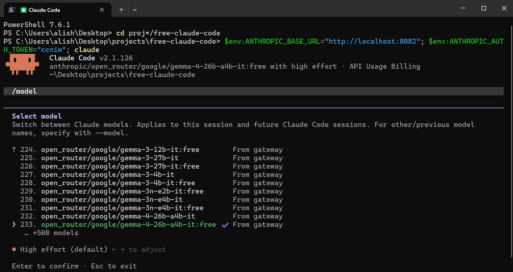
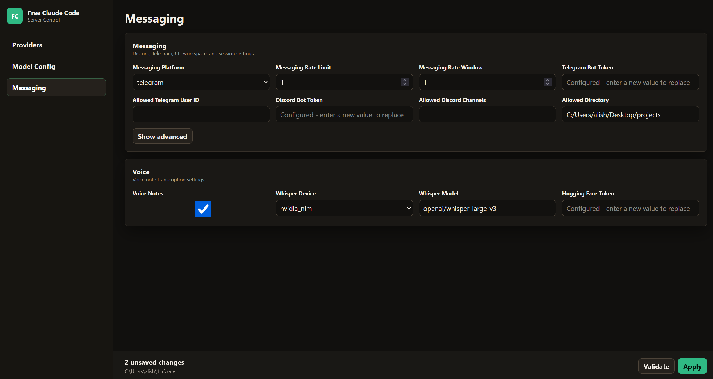

<div align="center">

# 🤖 Free Claude Code

Use Claude Code CLI, Codex CLI, their VS Code extensions, JetBrains ACP, or chat bots through your own provider-backed proxy.

[](https://opensource.org/licenses/MIT)
[](https://www.python.org/downloads/)
[](https://github.com/astral-sh/uv)
[](https://github.com/Alishahryar1/free-claude-code/actions/workflows/tests.yml)
[](https://pypi.org/project/ty/)
[](https://github.com/astral-sh/ruff)
[](https://github.com/Delgan/loguru)

Free Claude Code routes Anthropic Messages API traffic from Claude Code (CLI and VS Code extension) and OpenAI Responses API traffic from Codex (CLI and VS Code extension) to any provider. It keeps each client's protocol stable while letting you choose free, paid, or local models through the same proxy and Admin UI.

[Quick Start](#quick-start) · [Providers](#choose-a-provider) · [Clients](#connect-your-client) · [Integrations](#optional-integrations) · [Development](#development)

</div>

<div align="center">
  
  <p><em>Claude Code running through the Free Claude Code proxy.</em></p>
</div>

<div align="center">
  
  <p><em>Codex CLI using the local FCC Responses provider.</em></p>
</div>

<a id="model-picker"></a>

<div align="center">
  
  <p><em>Claude Code native <code>/model</code> picker with FCC gateway models.</em></p>
</div>

<div align="center">
  
  <p><em>Codex native <code>/model</code> picker with the generated FCC catalog.</em></p>
</div>

## Star History

<div align="center">
  <a href="https://star-history.com/#Alishahryar1/free-claude-code&Date">
    <picture>
      <source media="(prefers-color-scheme: dark)" srcset="https://api.star-history.com/svg?repos=Alishahryar1/free-claude-code&type=Date&theme=dark">
      <source media="(prefers-color-scheme: light)" srcset="https://api.star-history.com/svg?repos=Alishahryar1/free-claude-code&type=Date">
      
    </picture>
  </a>
</div>

## What You Get

- Drop-in proxy for Claude Code's Anthropic API calls (`/v1/messages`, `/v1/models`).
- Drop-in proxy for Codex via the OpenAI Responses API (`/v1/responses`).
- `fcc-claude` and `fcc-codex` launchers that read the current Admin UI port and auth token each time they start.
- 24 provider backends: NVIDIA NIM, OpenRouter, Google AI Studio (Gemini), DeepSeek, Mistral La Plateforme, Mistral Codestral, OpenCode Zen, OpenCode Go, Vercel AI Gateway, Hugging Face Inference Providers, Cohere, GitHub Models, Wafer, Kimi, MiniMax, Cerebras Inference, Groq, SambaNova, Fireworks AI, Cloudflare, Z.ai, LM Studio, llama.cpp, and Ollama.
- Per-model routing for Claude Code: send Opus, Sonnet, Haiku, and fallback traffic to different providers.
- Native Claude Code `/model` picker support through the proxy's `/v1/models` endpoint (see [Model Picker](#model-picker)).
- Native Codex `/model` picker support when launched through `fcc-codex`, using a generated local model catalog.
- Streaming, tool use, reasoning/thinking block handling, and local request optimizations.
- Optional Discord or Telegram bot wrapper for remote Claude Code sessions.
- Optional Usage through the Claude Code VS Code extension.
- Codex CLI and VS Code extension support through the shared `~/.codex/config.toml` provider config.
- Optional voice-note transcription through local Whisper or NVIDIA NIM.
- Local **Admin UI** at `/admin` to edit supported proxy settings, validate changes, and check providers (loopback access only).

## Quick Start

### 1. Install/Update The Proxy

macOS/Linux:

```bash
curl -fsSL "https://github.com/Alishahryar1/free-claude-code/blob/main/scripts/install.sh?raw=1" | sh
```

Windows PowerShell:

```powershell
irm "https://github.com/Alishahryar1/free-claude-code/blob/main/scripts/install.ps1?raw=1" | iex
```

Review the installers at [scripts/install.sh](https://github.com/Alishahryar1/free-claude-code/blob/main/scripts/install.sh) and [scripts/install.ps1](https://github.com/Alishahryar1/free-claude-code/blob/main/scripts/install.ps1). They install Claude Code and Codex when missing, then install or update the proxy. Re-run these commands to update to the latest version.

To remove only Free Claude Code (not uv, Claude Code, Codex, or the uv-managed Python runtime):

macOS/Linux:

```bash
curl -fsSL "https://raw.githubusercontent.com/Alishahryar1/free-claude-code/main/scripts/uninstall.sh" | sh
```

Windows PowerShell:

```powershell
irm "https://raw.githubusercontent.com/Alishahryar1/free-claude-code/main/scripts/uninstall.ps1" | iex
```

Review [scripts/uninstall.sh](https://github.com/Alishahryar1/free-claude-code/blob/main/scripts/uninstall.sh) and [scripts/uninstall.ps1](https://github.com/Alishahryar1/free-claude-code/blob/main/scripts/uninstall.ps1). They remove the FCC uv tool and always delete `~/.fcc/`. Stop any running `fcc-server`, `fcc-claude`, `fcc-codex`, `fcc-init`, or `free-claude-code` process before uninstalling.

### 2. Start The Proxy

```bash
fcc-server
```

After startup, Uvicorn prints the proxy bind address and the app logs the admin URL:

```text
INFO:     Admin UI: http://127.0.0.1:8082/admin (local-only)
```

Many terminals make these clickable. Use your configured `PORT` if it is not `8082`.

### 3. Open The Admin UI And Configure NVIDIA NIM

Open the **Admin UI** URL from the terminal output.

Need an NVIDIA NIM API key? Use the **[NVIDIA NIM provider](#nvidia-nim-provider)** section below, then scroll back up here.

<div align="center">
  
</div>

Paste your NVIDIA NIM API key into `NVIDIA_NIM_API_KEY`, then click **Validate** and **Apply**.

The default model is already set to `nvidia_nim/nvidia/nemotron-3-super-120b-a12b`. You can change it later from the same Admin UI.

### 4. Run Your Coding Agent

Keep `fcc-server` running while you work.

**Claude Code**

```bash
fcc-claude
```

`fcc-claude` reads the current configured port and auth token each time it starts, sets the Claude Code environment variables (including a 190k-token `CLAUDE_CODE_AUTO_COMPACT_WINDOW` for auto-compaction), and then launches the real `claude` command. When proxy auth is disabled, it still passes `ANTHROPIC_AUTH_TOKEN=fcc-no-auth` so newer Claude Code versions do not stop at their local login gate before contacting the proxy.

**Codex**

```bash
fcc-codex
```

`fcc-codex` reads the same port and auth token, registers an ephemeral `fcc` model provider that points at the local proxy's `/v1/responses` endpoint, generates a Codex model catalog from the proxy's `/v1/models` response, sets `FCC_CODEX_API_KEY` from the Admin UI auth token, strips official `OPENAI_*` credentials from the child environment, and then launches the real `codex` command. Type `/model` inside Codex to open its native picker. Pass through Codex args as usual, for example `fcc-codex exec "hello"`.

## Choose A Provider

Pick one provider, enter its key or local URL in the Admin UI, and set `MODEL` to a provider-prefixed model slug. `MODEL` is the fallback. `MODEL_OPUS`, `MODEL_SONNET`, and `MODEL_HAIKU` can override routing for Claude Code's model tiers.

<a id="nvidia-nim-provider"></a>

### 1. [NVIDIA NIM](https://build.nvidia.com/)

Get a key at [build.nvidia.com/settings/api-keys](https://build.nvidia.com/settings/api-keys).

In the Admin UI, paste it into `NVIDIA_NIM_API_KEY`. The default `MODEL` is `nvidia_nim/nvidia/nemotron-3-super-120b-a12b`.

Popular examples:

- `nvidia_nim/nvidia/nemotron-3-super-120b-a12b`
- `nvidia_nim/z-ai/glm5.1`
- `nvidia_nim/moonshotai/kimi-k2.5`
- `nvidia_nim/minimaxai/minimax-m2.5`

Browse models at [build.nvidia.com](https://build.nvidia.com/explore/discover).

### 2. [OpenRouter](https://openrouter.ai/)

Get a key at [openrouter.ai/keys](https://openrouter.ai/keys).

In the Admin UI, paste it into `OPENROUTER_API_KEY`, then set `MODEL` to an OpenRouter slug such as `open_router/openrouter/free`.

Browse [all models](https://openrouter.ai/models) or [free models](https://openrouter.ai/collections/free-models).

### 3. [Google AI Studio (Gemini)](https://aistudio.google.com/)

Get a Gemini API key at [Google AI Studio](https://aistudio.google.com/apikey) (see Google's [Gemini OpenAI compatibility](https://ai.google.dev/gemini-api/docs/openai) docs).

In the Admin UI, paste it into `GEMINI_API_KEY`, then set `MODEL` to a Gemini model slug such as `gemini/models/gemini-3.1-flash-lite`.

The Gemini API exposes an OpenAI-compatible endpoint at `https://generativelanguage.googleapis.com/v1beta/openai/`. Free tier quotas are per-model; prompts may be used to improve Google's products outside the UK/CH/EEA/EU unless your account region says otherwise—see Google's terms.

Popular examples:

- `gemini/models/gemini-3.1-flash-lite`

### 4. [DeepSeek](https://platform.deepseek.com/)

Get a key at [platform.deepseek.com/api_keys](https://platform.deepseek.com/api_keys).

In the Admin UI, paste it into `DEEPSEEK_API_KEY`, then set `MODEL` to a DeepSeek slug such as `deepseek/deepseek-chat`.

FCC uses DeepSeek's OpenAI-compatible Chat Completions endpoint so DeepSeek's prompt-cache hit/miss counters can be mapped into Claude-compatible usage metadata.

### 5. [Mistral La Plateforme](https://console.mistral.ai/)

[Mistral](https://mistral.ai) hosts an OpenAI-compatible Chat Completions API at `https://api.mistral.ai/v1`. Activate the **Experiment** plan on [console.mistral.ai](https://console.mistral.ai/) for free-tier API access with rate limits (upgrade for higher quotas).

In the Admin UI, paste your API key into `MISTRAL_API_KEY`, then set `MODEL` to a Mistral model slug such as `mistral/devstral-small-latest` or `mistral/mistral-small-latest`.

Popular examples:

- `mistral/devstral-small-latest`
- `mistral/mistral-small-latest`

Browse models at [Mistral documentation](https://docs.mistral.ai/).

### 6. [Mistral Codestral](https://console.mistral.ai/)

Mistral's **Codestral** gateway uses a **separate API key** from La Plateforme: provision `CODESTRAL_API_KEY`, then route with the `mistral_codestral/` prefix. The default upstream is **`https://codestral.mistral.ai/v1`** (OpenAI-compatible Chat Completions; same request shaping as the `mistral` provider). See Mistral's [coding / FIM domains](https://docs.mistral.ai/mistral-vibe/using-fim-api); the curated [free LLM API list](https://github.com/cheahjs/free-llm-api-resources#mistral-codestral) summarizes typical Codestral access terms.

Popular examples:

- `mistral_codestral/codestral-latest`

### 7. [OpenCode Zen](https://opencode.ai/)

Get an API key at [opencode.ai/auth](https://opencode.ai/auth).

In the Admin UI, paste it into `OPENCODE_API_KEY`, then set `MODEL` to an OpenCode Zen model slug such as `opencode/gpt-5.3-codex`. The same `OPENCODE_API_KEY` powers **OpenCode Go** (below); use `opencode_go/` slugs there.

OpenCode Zen is a curated model gateway that provides access to models from Anthropic, OpenAI, Google, DeepSeek, and more through a single API key and OpenAI-compatible endpoint at `https://opencode.ai/zen/v1`.

Popular examples:

- `opencode/gpt-5.3-codex`
- `opencode/claude-sonnet-4`
- `opencode/deepseek-v4-flash-free` (free)
- `opencode/gemini-3-flash`
- `opencode/big-pickle` (free)
- `opencode/glm-5.1`

Browse available models at [opencode.ai](https://opencode.ai).

### 8. [OpenCode Go](https://opencode.ai/)

Get an API key at [opencode.ai/auth](https://opencode.ai/auth) (same as OpenCode Zen).

In the Admin UI, use `OPENCODE_API_KEY`, then set `MODEL` to an OpenCode Go model slug such as `opencode_go/minimax-m2.7`.

OpenCode Go is a subscription gateway with its own curated catalog and OpenAI-compatible endpoint at `https://opencode.ai/zen/go/v1`. It shares the **same OpenCode API key** as Zen; only the slug prefix (`opencode_go/` vs `opencode/`) and upstream path differ.

Popular examples:

- `opencode_go/minimax-m2.7`

Browse available models at [opencode.ai](https://opencode.ai).

### 9. [Vercel AI Gateway](https://vercel.com/docs/ai-gateway)

Create an AI Gateway API key from Vercel, then paste it into `AI_GATEWAY_API_KEY` in the Admin UI.

Set `MODEL` to a Vercel model slug such as `vercel/openai/gpt-5.5`, `vercel/anthropic/claude-sonnet-4.6`, or `vercel/google/gemini-3.1-flash-lite-preview`.

Vercel AI Gateway exposes an OpenAI-compatible endpoint at `https://ai-gateway.vercel.sh/v1`, supports `GET /models`, streaming Chat Completions, tool calls, provider options, and gateway fallbacks. FCC routes it through the shared OpenAI-chat transport and preserves request `extra_body` for Vercel-specific options.

Browse models at [Vercel models and providers](https://vercel.com/docs/ai-gateway/models-and-providers).

### 10. [Hugging Face Inference Providers](https://huggingface.co/docs/inference-providers/)

Create a Hugging Face token with Inference Providers permission at [huggingface.co/settings/tokens](https://huggingface.co/settings/tokens), then paste it into `HUGGINGFACE_API_KEY` in the Admin UI.

Set `MODEL` to a Hugging Face model slug such as `huggingface/openai/gpt-oss-120b:fastest`, `huggingface/Qwen/Qwen3-Coder-480B-A35B-Instruct:fastest`, or `huggingface/deepseek-ai/DeepSeek-R1:fastest`.

Hugging Face routes through the OpenAI-compatible router at `https://router.huggingface.co/v1`. FCC uses the shared OpenAI-chat transport, preserves request `extra_body` for Hugging Face provider options, and does not replay prior hidden reasoning into Chat Completions because that request field is not documented by Hugging Face. New reasoning emitted by the upstream is still shown as Claude thinking.

If your existing repo `.env` or `~/.fcc/.env` uses the old voice setting `HF_TOKEN`, `fcc-server`/`fcc-init` renames it to `HUGGINGFACE_API_KEY`. Explicit `FCC_ENV_FILE` files are not rewritten automatically; rename the key there manually.

Browse models at [Hugging Face Inference Providers](https://huggingface.co/docs/inference-providers/).

### 11. [Cohere](https://cohere.com/)

Create a Cohere API key at [dashboard.cohere.com/api-keys](https://dashboard.cohere.com/api-keys), then paste it into `COHERE_API_KEY` in the Admin UI.

Set `MODEL` to a Cohere model slug such as `cohere/command-a-plus-05-2026`.

Cohere routes through its OpenAI-compatible Compatibility API at `https://api.cohere.ai/compatibility/v1`. FCC keeps Cohere-specific request shaping in the Cohere provider: unsupported compatibility fields are removed, Cohere-compatible structured-output knobs are accepted through `extra_body`, and Claude thinking maps to Cohere's documented `reasoning_effort` values.

Browse models at [Cohere models](https://docs.cohere.com/docs/models).

### 12. [GitHub Models](https://github.com/marketplace?type=models)

Create a GitHub personal access token with Models access, then paste it into `GITHUB_MODELS_TOKEN` in the Admin UI.

Set `MODEL` to a GitHub Models slug such as `github_models/openai/gpt-4.1`.

GitHub Models routes through the OpenAI-compatible inference endpoint at `https://models.github.ai/inference`. FCC keeps GitHub-specific API headers and catalog filtering in the GitHub Models provider; only catalog models that advertise streaming and tool-calling are shown through model discovery.

Browse models at [GitHub Marketplace Models](https://github.com/marketplace?type=models).

### 13. [Wafer](https://wafer.ai/)

Get a key from [wafer.ai](https://wafer.ai). In the Admin UI, paste it into `WAFER_API_KEY`, then set `MODEL` to a Wafer Pass model such as `wafer/DeepSeek-V4-Pro`.

Popular examples:

- `wafer/DeepSeek-V4-Pro`
- `wafer/MiniMax-M2.7`
- `wafer/Qwen3.5-397B-A17B`
- `wafer/GLM-5.1`

This provider uses Wafer's OpenAI-compatible Chat Completions endpoint at `https://pass.wafer.ai/v1/chat/completions`; FCC maps Claude-style thinking to Wafer's explicit thinking controls.

### 14. [Kimi](https://platform.moonshot.ai/)

Get a key at [platform.moonshot.ai/console/api-keys](https://platform.moonshot.ai/console/api-keys).

In the Admin UI, paste it into `KIMI_API_KEY`, then set `MODEL` to a Kimi slug such as `kimi/kimi-k2.5`.

This provider calls Kimi's OpenAI-compatible Chat Completions API at `https://api.moonshot.ai/v1/chat/completions`; FCC keeps Kimi-specific thinking controls inside the Kimi provider.

Browse models at [platform.moonshot.ai](https://platform.moonshot.ai).

### 15. [MiniMax](https://platform.minimax.io/)

Get a key from [MiniMax](https://platform.minimax.io/user-center/basic-information/interface-key).

In the Admin UI, paste it into `MINIMAX_API_KEY`, then set `MODEL` to a MiniMax slug such as `minimax/MiniMax-M3`.

This provider calls MiniMax's OpenAI-compatible Chat Completions API at `https://api.minimax.io/v1/chat/completions`. `MiniMax-M3` is the recommended default because MiniMax documents controllable thinking for that model; other MiniMax models remain discoverable through the provider model list.

### 16. [Cerebras Inference](https://inference-docs.cerebras.ai/quickstart)

Sign up and create an API key in the [Cerebras Cloud Console](https://cloud.cerebras.ai) (see [Quickstart](https://inference-docs.cerebras.ai/quickstart)).

In the Admin UI, set `CEREBRAS_API_KEY`, then route with `MODEL` such as `cerebras/llama3.1-8b` or `cerebras/gpt-oss-120b` (ids from [List models](https://inference-docs.cerebras.ai/api-reference/models/list-models)).

Cerebras exposes an OpenAI-compatible API at `https://api.cerebras.ai/v1` ([OpenAI compatibility](https://inference-docs.cerebras.ai/resources/openai)). Non-standard request fields should go in `extra_body` when using the OpenAI client; see the same page. For reasoning models and parameters, see [Reasoning](https://inference-docs.cerebras.ai/capabilities/reasoning). This proxy follows other OpenAI-compat adapters for thinking via `reasoning_content` when Claude-style thinking is enabled.

### 17. [Groq](https://console.groq.com/)

Get an API key at [console.groq.com/keys](https://console.groq.com/keys).

In the Admin UI, paste it into `GROQ_API_KEY`, then set `MODEL` to a Groq OpenAI-compat model slug such as `groq/llama-3.3-70b-versatile`.

Groq routes through `https://api.groq.com/openai/v1` ([OpenAI-compatible Chat Completions](https://console.groq.com/docs/openai)). Some request fields yield HTTP 400; this adapter strips known-unsupported shapes (documented in Groq's compatibility notes).

Reasoning-heavy models expose extra knobs documented under [Groq reasoning](https://console.groq.com/docs/reasoning). This release mirrors other OpenAI-compat adapters for thinking via `reasoning_content` deltas when Claude-style thinking is enabled; you can tune advanced parameters through request `extra_body` when needed.

Browse models at [console.groq.com/docs/models](https://console.groq.com/docs/models).

### 18. [SambaNova](https://sambanova.ai/)

Create an API key in the [SambaNova Cloud console](https://cloud.sambanova.ai/apis).

In the Admin UI, paste it into `SAMBANOVA_API_KEY`, then set `MODEL` to a SambaNova model slug such as `sambanova/Meta-Llama-3.3-70B-Instruct`.

SambaNova Cloud exposes an OpenAI-compatible Chat Completions API at `https://api.sambanova.ai/v1` ([OpenAI compatibility](https://docs.sambanova.ai/cloud/docs/capabilities/openai-compatibility)). This proxy follows the shared OpenAI-compat adapters, mapping Claude-style thinking to `reasoning_content` deltas where the model supports it.

Browse models at [SambaNova Cloud models](https://docs.sambanova.ai/cloud/docs/get-started/supported-models).

### 19. [Fireworks AI](https://fireworks.ai/)

Get an API key at [fireworks.ai/account/api-keys](https://fireworks.ai/account/api-keys).

In the Admin UI, paste it into `FIREWORKS_API_KEY`, then set `MODEL` to a Fireworks model slug such as `fireworks/accounts/fireworks/models/llama-v3p3-70b-instruct`.

Fireworks exposes an OpenAI-compatible Chat Completions API at `https://api.fireworks.ai/inference/v1/chat/completions`. Vendor-specific JSON keys can still be passed through request `extra_body` when they do not override FCC-owned chat fields.

Browse models at [fireworks.ai/models](https://fireworks.ai/models).

### 20. [Cloudflare](https://developers.cloudflare.com/workers-ai/)

Create a Cloudflare API token and copy your account ID from the Cloudflare dashboard.

In the Admin UI, set `CLOUDFLARE_API_TOKEN` and `CLOUDFLARE_ACCOUNT_ID`, then set `MODEL` to a Cloudflare Workers AI model slug such as `cloudflare/@cf/moonshotai/kimi-k2.6`.

This provider calls Cloudflare's account-scoped **OpenAI-compatible** Chat Completions API at `https://api.cloudflare.com/client/v4/accounts/<account_id>/ai/v1/chat/completions`. Use literal Workers AI model IDs, including the `@cf/` prefix when the catalog model includes it.

### 21. [Z.ai](https://z.ai/)

Get an API key at [Z.ai/manage-apikey/apikey-list](https://z.ai/manage-apikey/apikey-list).

In the Admin UI, paste it into `ZAI_API_KEY`, then set `MODEL` to a Z.ai model slug such as `zai/glm-5.2`.

This provider calls Z.ai's GLM Coding Plan OpenAI-compatible Chat Completions API at `https://api.z.ai/api/coding/paas/v4/chat/completions`. FCC keeps Z.ai `clear_thinking=false` handling inside the Z.ai provider so tool workflows can preserve prior reasoning.

Popular examples:

- `zai/glm-5.2`
- `zai/glm-5-turbo`

Browse models at [Z.ai](https://z.ai).

### 22. [LM Studio](https://lmstudio.ai/)

Start LM Studio's local server and load a model. In the Admin UI, keep or update `LM_STUDIO_BASE_URL`, then set `MODEL` to the model identifier shown by LM Studio, prefixed with `lmstudio/`.

Prefer models with tool-use support for Claude Code workflows.

### 23. [llama.cpp](https://github.com/ggml-org/llama.cpp)

Start `llama-server` with an Anthropic-compatible `/v1/messages` endpoint and enough context for Claude Code requests.

In the Admin UI, keep or update `LLAMACPP_BASE_URL`, then set `MODEL` to the local model slug, prefixed with `llamacpp/`.

For local coding models, context size matters. If llama.cpp returns HTTP 400 for normal Claude Code requests, increase `--ctx-size` and verify the model/server build supports the requested features.

### 24. [Ollama](https://ollama.com/)

Run Ollama and pull a model:

```bash
ollama pull llama3.1
ollama serve
```

In the Admin UI, keep or update `OLLAMA_BASE_URL`, then set `MODEL` to the same tag shown by `ollama list`, prefixed with `ollama/`.

`OLLAMA_BASE_URL` is the Ollama server root; do not append `/v1`. Example model slugs include `ollama/llama3.1` and `ollama/llama3.1:8b`.

### 25. Mix Providers By Model Tier

Each model tier can use a different provider by setting `MODEL_OPUS`, `MODEL_SONNET`, and `MODEL_HAIKU` in the Admin UI. Leave a tier blank to inherit `MODEL`. These tier overrides apply to Claude model names that contain `opus`, `sonnet`, or `haiku`. Codex uses the Admin `MODEL` default through `fcc-codex` unless a session requests a provider-prefixed slug directly.

For example, you can route Opus to `nvidia_nim/moonshotai/kimi-k2.6`, Sonnet to `open_router/openrouter/free`, Haiku to `lmstudio/qwen3.5-coder`, and keep the fallback `MODEL` on `zai/glm-5.2`.

<a id="connect-your-client"></a>

## Connect Your Client

### 1. Claude Code CLI

For terminal use, prefer the installed launcher:

```bash
fcc-claude
```

The Admin UI manages proxy config, restarts the server when runtime settings change, and `fcc-claude` reads the current Admin UI-managed port and auth token every time it starts. It also sets `CLAUDE_CODE_AUTO_COMPACT_WINDOW` to `190000` for auto-compaction. When proxy auth is blank, `fcc-claude` injects `ANTHROPIC_AUTH_TOKEN=fcc-no-auth` only to satisfy Claude Code's local login check; the proxy still treats blank auth as disabled.

### 2. Codex CLI

For terminal use, prefer the installed launcher:

```bash
fcc-codex
```

The installer provisions Codex when it is missing (`npm install -g @openai/codex`). `fcc-codex` injects ephemeral Codex config on every launch:

- `model_provider=fcc`
- `model_providers.fcc.base_url=http://127.0.0.1:<PORT>/v1`
- `model_providers.fcc.env_key=FCC_CODEX_API_KEY`
- `model_providers.fcc.wire_api=responses`
- `model_catalog_json=~/.fcc/codex-model-catalog.json`

The Admin UI auth token is reused as `FCC_CODEX_API_KEY`. Official OpenAI credentials are stripped from the child environment so traffic stays on the local proxy. The generated model catalog lets Codex's native `/model` picker list provider-selectable FCC model slugs. If the catalog cannot be fetched or written, `fcc-codex` warns and still launches without picker injection.

**Advanced manual setup**

If you launch `codex` directly, point it at the proxy with equivalent config:

```bash
codex \
  -c 'model_provider="fcc"' \
  -c 'model_providers.fcc.name="Free Claude Code"' \
  -c 'model_providers.fcc.base_url="http://127.0.0.1:8082/v1"' \
  -c 'model_providers.fcc.env_key="FCC_CODEX_API_KEY"' \
  -c 'model_providers.fcc.wire_api="responses"' \
  exec "hello"
```

Set `FCC_CODEX_API_KEY` to the same value as `ANTHROPIC_AUTH_TOKEN` in the Admin UI.

### 3. Claude Code in VS Code

Install the [Claude Code extension](https://marketplace.visualstudio.com/items?itemName=anthropic.claude-code). Open Settings, search for `claude-code.environmentVariables`, choose **Edit in settings.json**, and add:

```json
"claudeCode.environmentVariables": [
  { "name": "ANTHROPIC_BASE_URL", "value": "http://localhost:8082" },
  { "name": "ANTHROPIC_AUTH_TOKEN", "value": "freecc" },
  { "name": "CLAUDE_CODE_ENABLE_GATEWAY_MODEL_DISCOVERY", "value": "1" },
  { "name": "CLAUDE_CODE_AUTO_COMPACT_WINDOW", "value": "190000" }
]
```

Reload the extension. If the extension shows a login screen, choose the Anthropic Console path once; the local proxy still handles model traffic after the environment variables are active.

### 4. Codex in VS Code

Install the [Codex extension](https://marketplace.visualstudio.com/items?itemName=openai.chatgpt). The extension shares the same user-level Codex config as the CLI (`~/.codex/config.toml` on macOS/Linux, `%USERPROFILE%\.codex\config.toml` on Windows).

Create or edit that file with the `fcc` provider pointing at your local proxy:

```toml
model_provider = "fcc"
model = "nvidia_nim/nvidia/nemotron-3-super-120b-a12b"

[model_providers.fcc]
name = "Free Claude Code"
base_url = "http://127.0.0.1:8082/v1"
env_key = "FCC_CODEX_API_KEY"
wire_api = "responses"
```

Set `model` to your Admin UI `MODEL` value. Replace `8082` if your proxy uses a different `PORT`.

Store the proxy auth token in `~/.codex/auth.json` (or the Windows equivalent):

```json
{
  "FCC_CODEX_API_KEY": "freecc"
}
```

Use the same value as `ANTHROPIC_AUTH_TOKEN` in the Admin UI. Restart VS Code after changing these files. On Windows with WSL-backed Codex, edit the WSL `~/.codex/` files instead and enable `chatgpt.runCodexInWindowsSubsystemForLinux` in VS Code settings when needed.

### 5. Claude Code in JetBrains ACP

Edit the installed Claude ACP config:

- Windows: `C:\Users\%USERNAME%\AppData\Roaming\JetBrains\acp-agents\installed.json`
- Linux/macOS: `~/.jetbrains/acp.json`

Set the environment for `acp.registry.claude-acp`:

```json
"env": {
  "ANTHROPIC_BASE_URL": "http://localhost:8082",
  "ANTHROPIC_AUTH_TOKEN": "freecc",
  "CLAUDE_CODE_ENABLE_GATEWAY_MODEL_DISCOVERY": "1",
  "CLAUDE_CODE_AUTO_COMPACT_WINDOW": "190000"
}
```

Restart the IDE after changing the file.

## Optional Integrations

For every integration below, change **managed proxy settings** only in the **Admin UI** at `/admin`: edit fields, click **Validate**, then **Apply**. The footer shows where the managed config is stored; this README does not walk through editing that file by hand.

### 1. Discord And Telegram Bots

The bot wrapper runs Claude Code sessions remotely, streams progress, supports reply-based conversation branches, and can stop or clear tasks. Discord and Telegram bots use Claude Code today; use `fcc-codex` or the Codex VS Code extension for Codex sessions.

**Discord**

1. Create the bot in the [Discord Developer Portal](https://discord.com/developers/applications).
2. Enable **Message Content Intent**.
3. Invite the bot with read, send, and message history permissions.
4. Copy the bot token and the numeric channel ID (or IDs) where the bot should respond.

**Telegram**

1. Create a bot with [@BotFather](https://t.me/BotFather) and copy the bot token.
2. Get your numeric user ID from [@userinfobot](https://t.me/userinfobot) so only you can use the bot.

**Configure in the Admin UI**

1. With `fcc-server` running, open the **Admin UI** URL from the terminal output.
2. In the sidebar, choose **Messaging**.
3. Set **Messaging Platform** to **discord** or **telegram**.
4. For Discord, paste **Discord Bot Token** and **Allowed Discord Channels**. For Telegram, paste **Telegram Bot Token** and **Allowed Telegram User ID**.
5. Set **Allowed Directory** to an absolute path on the machine running the proxy—the workspace root the bot may use.
6. Click **Validate**, then **Apply**. Restart the server if the UI says one is required.

<div align="center">
  
</div>

<p align="center"><em>Admin UI → Messaging (platform, bots, and Voice)</em></p>

**Useful commands**

- `/stop` cancels a task; reply to a task message to stop only that branch.
- `/clear` resets sessions; reply to clear one branch.
- `/stats` shows session state.

### 2. Voice Notes

Voice notes work on Discord and Telegram after you extend your [Free Claude Code install](#1-fast-install) with the matching optional extras.

macOS/Linux:

```bash
# NVIDIA NIM transcription (Riva gRPC)
curl -fsSL "https://github.com/Alishahryar1/free-claude-code/blob/main/scripts/install.sh?raw=1" | sh -s -- --voice-nim

# Local Whisper (CPU or CUDA)
curl -fsSL "https://github.com/Alishahryar1/free-claude-code/blob/main/scripts/install.sh?raw=1" | sh -s -- --voice-local

# Both backends
curl -fsSL "https://github.com/Alishahryar1/free-claude-code/blob/main/scripts/install.sh?raw=1" | sh -s -- --voice-all

# Local Whisper with CUDA
curl -fsSL "https://github.com/Alishahryar1/free-claude-code/blob/main/scripts/install.sh?raw=1" | sh -s -- --voice-local --torch-backend cu130
```

Windows PowerShell:

```powershell
# NVIDIA NIM transcription (Riva gRPC)
& ([scriptblock]::Create((irm "https://github.com/Alishahryar1/free-claude-code/blob/main/scripts/install.ps1?raw=1"))) -VoiceNim

# Local Whisper (CPU or CUDA)
& ([scriptblock]::Create((irm "https://github.com/Alishahryar1/free-claude-code/blob/main/scripts/install.ps1?raw=1"))) -VoiceLocal

# Both backends
& ([scriptblock]::Create((irm "https://github.com/Alishahryar1/free-claude-code/blob/main/scripts/install.ps1?raw=1"))) -VoiceAll

# Local Whisper with CUDA
& ([scriptblock]::Create((irm "https://github.com/Alishahryar1/free-claude-code/blob/main/scripts/install.ps1?raw=1"))) -VoiceLocal -TorchBackend cu130
```

Restart `fcc-server` after reinstalling.

In the **Admin UI**, open **Messaging** and scroll to **Voice**. Turn on **Voice Notes**, choose **Whisper Device** (`cpu`, `cuda`, or `nvidia_nim`), and set **Whisper Model**. For gated local Whisper models, set **Hugging Face API Key** on the **Providers** view. For **nvidia_nim** transcription, install the `voice` extra and set **NVIDIA NIM API Key** on the **Providers** view. The screenshot above shows the **Voice** block in the same view.

## How It Works

<div align="center">
  
</div>

Diagram source: [`assets/how-it-works.mmd`](assets/how-it-works.mmd).

Important pieces:

- FastAPI exposes Anthropic-compatible routes such as `/v1/messages`, `/v1/messages/count_tokens`, and `/v1/models`, plus OpenAI Responses at `/v1/responses`.
- Claude Code sends Anthropic Messages; Codex sends OpenAI Responses SSE to the same proxy.
- Responses requests convert to Anthropic Messages internally, then share the same model router, normalizer, and provider adapters.
- `fcc-codex` registers a custom `fcc` provider that points Codex at the local proxy's `/v1/responses` endpoint.
- Model routing resolves Claude model names to `MODEL_OPUS`, `MODEL_SONNET`, `MODEL_HAIKU`, or `MODEL`.
- NIM, Gemini, DeepSeek, Mistral, Codestral, OpenCode Zen, OpenCode Go, Vercel AI Gateway, Hugging Face, Cohere, GitHub Models, Cerebras, Groq, SambaNova, and Cloudflare use OpenAI chat streaming translated into Anthropic SSE.
- Cloud providers use OpenAI-compatible Chat Completions transports with provider-specific quirks kept in each provider package. Native Anthropic Messages transports are local-only for llama.cpp and Ollama.
- The proxy normalizes thinking blocks, tool calls, token usage metadata, and provider errors into the shape each client expects.
- Request optimizations answer trivial Claude Code probes locally to save latency and quota.

## Development

### 1. Project Structure

```text
free-claude-code/
├── api/                   # FastAPI routes, service layer, routing, optimizations
├── core/                  # Shared Anthropic protocol helpers, SSE, OpenAI Responses
│   └── openai_responses/  # Responses ↔ Anthropic conversion and SSE mapping
├── providers/             # Provider runtime, transports, rate limiting
├── messaging/             # Discord/Telegram runtimes, outbound ports, voice
├── cli/                   # Package entry points and client CLI process management
├── config/                # Settings, provider catalog, logging
└── tests/                 # Unit and contract tests
```

### 2. Run From Source

Use this path if you are developing or want to run directly from a checkout:

```bash
git clone https://github.com/Alishahryar1/free-claude-code.git
cd free-claude-code
uv run fcc-server
```

### 3. Commands

Run the local CI sequence (requires `uv` on PATH). The local scripts format
Python files and apply autofixable Ruff lint fixes before type checking and
tests:

```bash
./scripts/ci.sh
```

```powershell
.\scripts\ci.ps1
```

Useful flags: `--only pytest`, `--skip pytest`, `--dry-run` (PowerShell: `-Only pytest`, `-Skip pytest`, `-DryRun`).

Or run individual repair/check commands manually:

```bash
uv run ruff format
uv run ruff check --fix
uv run ty check
uv run pytest -v --tb=short
```

GitHub CI remains check-only for Ruff with `uv run ruff format --check` and
`uv run ruff check`, so required status checks verify committed code.

CI also enforces a ban on `# type: ignore` / `# ty: ignore` suppressions; `scripts/ci.sh` and `scripts/ci.ps1` run that grep too.

### 4. Package Scripts

`pyproject.toml` installs:

- `fcc-server`: starts the proxy with configured host and port.
- `fcc-init`: optional advanced scaffold for `~/.fcc/.env`; prefer the **Admin UI** for normal configuration.
- `fcc-claude`: launches Claude Code with the configured local proxy URL, an auth-token env var or `fcc-no-auth` sentinel, model discovery flag, and a 190k `CLAUDE_CODE_AUTO_COMPACT_WINDOW` for auto-compaction.
- `fcc-codex`: launches Codex with ephemeral `fcc` provider config pointing at the local proxy's `/v1/responses` endpoint, a generated native `/model` picker catalog, and `FCC_CODEX_API_KEY` from the Admin UI auth token.
- `free-claude-code`: compatibility alias for `fcc-server`.

### 5. Extending

- Add OpenAI-compatible providers by extending `OpenAIChatTransport`.
- Add Anthropic Messages providers by extending `AnthropicMessagesTransport`.
- Extend OpenAI Responses conversion in `core/openai_responses/` when Codex adds new request or stream shapes.
- Register provider metadata in `config.provider_catalog` and factory wiring in `providers.runtime`.
- Add messaging platforms by wiring runtime, outbound, and inbound-normalizer ports in `messaging/platforms/`.

## Contributing

- [`.env.example`](.env.example) lists env key names as a read-only reference for contributors; use the **Admin UI** to change managed proxy settings.
- Report bugs and feature requests in [Issues](https://github.com/Alishahryar1/free-claude-code/issues). For bug always include all model mapping, current model when issue occured and the issue string
- Keep changes small and covered by focused tests.
- Do not open Docker integration PRs.
- Do not open README change PRs just open an issue for it.
- Run the full check sequence before opening a pull request.
- The syntax `except X, Y` is brought back in python 3.14 final version (not in 3.14 alpha). Keep in mind before opening PRs.

## License

MIT License. See [LICENSE](LICENSE) for details.
